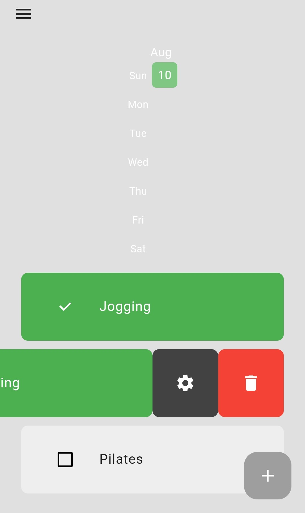

# 🚀 Habitude

# Description

An app to track your habits, as well as a heatmap calendar for how frequently you have completed habits, help set specific goals, log daily progress and visualize your habits.

---

## 🖼️ Demo

---

## 🧠 Tech Stack

**Frontend:** Dart, Flutter  

**Database:** Isar database

**Other Tools:** Git, Provider, Flutter heat map

---

## ⚙️ Setup Instructions

### 1. Clone the repo

git clone https://github.com/devdeejay27/habitude.git

cd habitude

### 2. Install dependencies

flutter clean

flutter pub get

### 3. Run the app in terminal

flutter run

## 👨‍💻 Author

Chukwudumeje Obieli

@devdeejay27

📧 dum_obieli@yahoo.com
